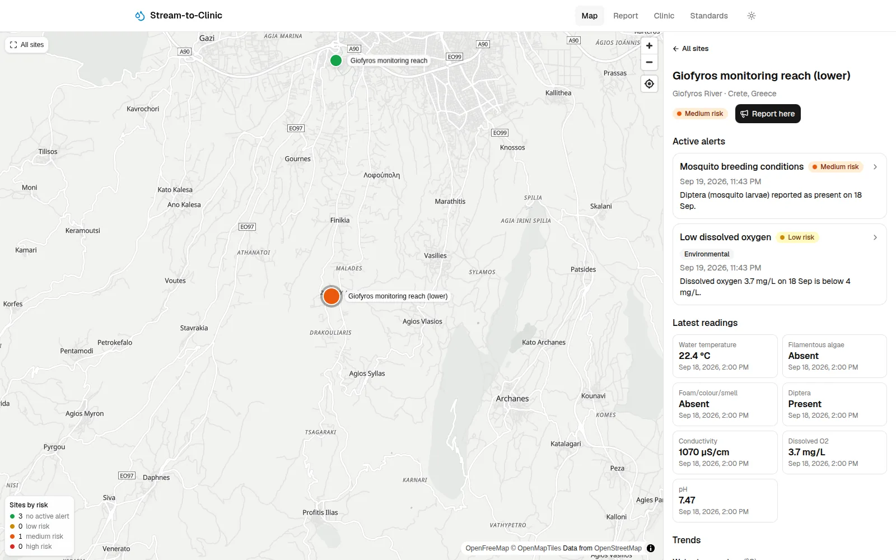
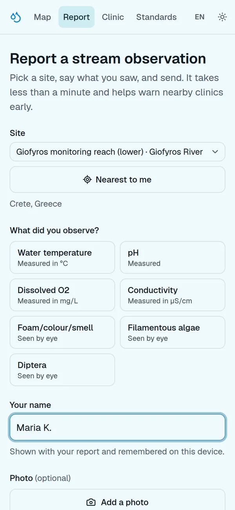
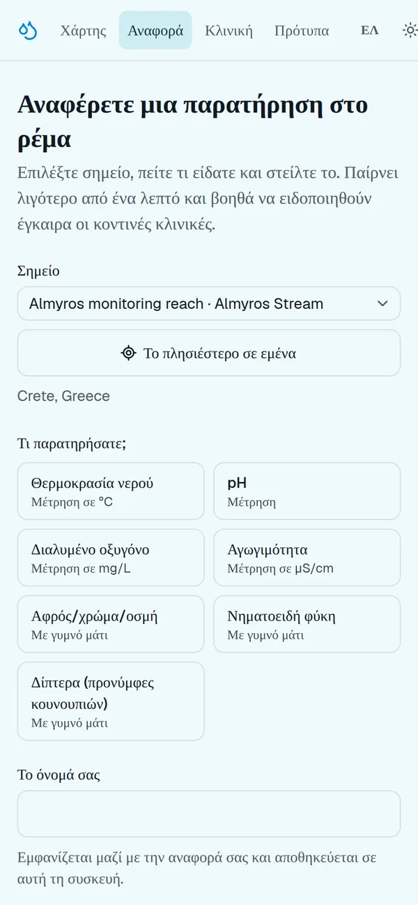
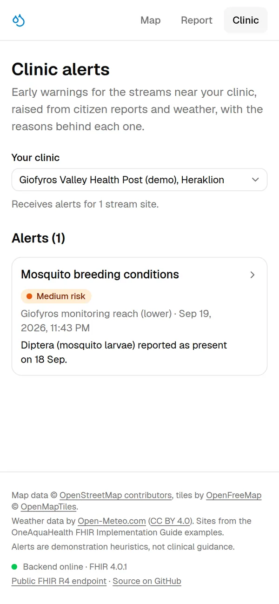
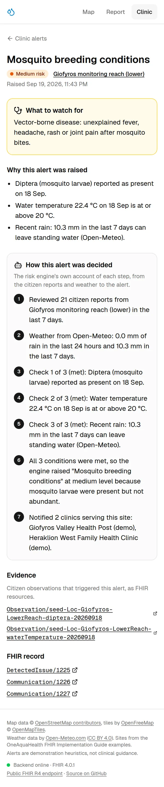
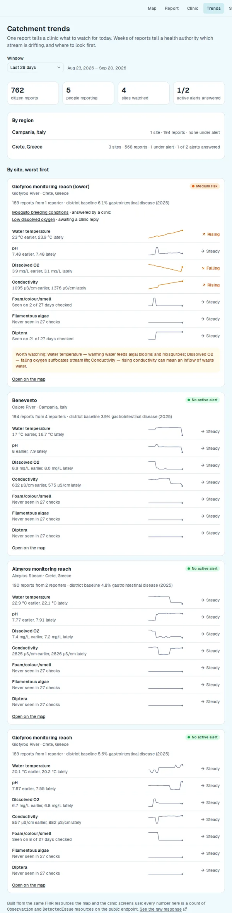

<div align="center">

# Stream-to-Clinic

**A citizen spots algae on Monday. Nearby clinics are warned on Tuesday — not after the first ER cases.**

One Health early warning for urban streams: citizen observations become HL7 FHIR resources, and risky patterns become alerts for the clinics that serve the neighbourhood.

[](https://github.com/Sarcastic-Soul/stream-to-clinic/actions/workflows/ci.yml)
[](https://github.com/Sarcastic-Soul/stream-to-clinic/actions/workflows/validate-fhir.yml)
[-orange)](https://hl7.org/fhir/R4/)
[](https://github.com/hl7-eu/oah)
[](LICENSE)

[**Live app**](https://stream-to-clinic.vercel.app) · [**Public FHIR R4 endpoint**](https://oneaquahealth.duckdns.org/fhir/metadata) · [**Standards page**](https://stream-to-clinic.vercel.app/standards) · [Plan](docs/PLAN.md) · [Architecture](docs/ARCHITECTURE.md) · [API](docs/API.md)

Built for the [OneAquaHealth IEEE Global Hackathon](https://oneaquahealth-ieee-hackathon.devpost.com/) — **Track 7, Digital Health Standards**.

</div>

---

## The problem

- Citizens notice when a stream changes — algae mats, foam, smell, mosquito larvae — often days before anyone falls ill.
- Clinics see the skin, gastrointestinal and vector-borne cases that follow, with no idea why.
- Environmental data and health data sit in separate systems, with no shared standard between them.

## What it does

| Step | What happens | In FHIR |
|---|---|---|
| 1. Report | Citizen picks a site (or the nearest by GPS), an indicator and a value, optionally a photo — under 30 seconds, offline-capable | `Observation` (`ObservationIndicatorsOah`), `Media` + `Binary` |
| 2. Assess | A rule engine combines recent reports with Open-Meteo rainfall: algal bloom, sewage overflow, mosquito breeding, low oxygen | — |
| 3. Explain | Every alert carries plain-language reasons and a numbered account of how the decision was reached | `DetectedIssue.evidence`, `.detail` |
| 4. Notify | Clinics serving that stream get the alert; environment-only risks stay on the map | `Communication` |
| 5. Act | Clinicians see one screen: what to watch for, and why | — |
| 6. Integrate | Observations written to the FHIR server by *any* system run the same assessment | `Subscription` (rest-hook) |

## Screenshots

| Map and site detail | Report (phone) | The same form in Greek |
|---|---|---|
|  |  |  |

| Clinic alerts | Alert explained, answered | Four weeks of reports |
|---|---|---|
|  |  |  |

## Highlights

| | |
|---|---|
| 🌍 **Real OAH sites** | Almyros and Giofyros (Crete), Benevento (Italy), straight from the IG examples |
| ✅ **Validated in CI** | Every resource the API produces is checked against the OAH IG; the build fails on a profile error |
| 🔎 **Explainable, not magic** | Four documented rules with configurable thresholds — no black-box model |
| 📴 **Works offline** | Installable PWA; reports queue in IndexedDB and send themselves when the connection returns |
| 🌍 **Speaks the local language** | English, Greek and Italian on the citizen screens — the languages of the pilot sites, not just the developers' |
| 📈 **From one report to a pattern** | A four-week catchment view: which stream is warming, losing oxygen or rising in conductivity, per site and per region, next to the district's disease baseline |
| 🔁 **Closed loop** | Clinics answer an alert in one click; the reply is a FHIR `Communication` linked to the original, so the environmental side sees which warnings led to action |
| ✍️ **AI that only writes, never decides** | A model rewrites an alert as a notice for the clinic desk, from the engine's own reasons; the draft is a `Communication` sent by a `Device` with a `Provenance` naming it, so machine-written text stays marked as such |
| ✍️ **AI that writes, never decides** | A model rewrites an alert as a notice for the clinic desk, from the engine's own reasons only; the draft is a `Communication` sent by a `Device` with a `Provenance` naming it, so machine-written text stays marked as such |
| 🧾 **Traceable** | Every citizen report carries a `Provenance`: who reported it, which app assembled it, when it was recorded |
| 🗺️ **Readable map** | Colourful basemap, place names in one language, quieter country labels, nearby sites clustered with a count |
| 🌓 **Light / dark / system** | Theme toggle applied before the first paint, no flash |
| ♿ **Accessible** | axe: 0 violations on every page, in both themes |
| 📦 **Open data** | Download any site as a FHIR `collection` Bundle |

## How it fits together

```
Citizen / clinician browser (installable PWA, Next.js on Vercel)
        │ HTTPS
        ▼
Caddy (oneaquahealth.duckdns.org, automatic HTTPS)
   ├─ GET /fhir/*  (public, read-only) ─────► HAPI FHIR JPA Server (R4) ──► PostgreSQL 18
   └─ everything else ──► API (Fastify, TypeScript)        ▲        │
                            • maps reports to OAH profiles │ writes │ rest-hook Subscription
                            • risk engine + Open-Meteo ────┘        │ (new Observations,
                            • DetectedIssue + Communication ◄───────┘  internal network)
```

## FHIR resource model

| Concept | FHIR resource | Profile |
|---|---|---|
| Stream site | `Location` | `LocationOah` |
| Citizen report | `Observation` | `ObservationIndicatorsOah` |
| Report photo | `Media` + `Binary` | Core R4 |
| District cohort | `Group` | `GroupOah` |
| Baseline health data | `Observation` | `ObservationHealthMeasureOah` |
| Clinic and the sites it serves | `Organization` + `HealthcareService` | Core R4 |
| Health alert | `DetectedIssue` | Core R4 |
| Clinic notification | `Communication` | Core R4 |
| Trigger for external observations | `Subscription` (rest-hook) | Core R4 |

Details: [docs/ARCHITECTURE.md](docs/ARCHITECTURE.md#fhir-resource-model). API contract: [docs/API.md](docs/API.md).

## Risk rules

| Risk | Trigger | Clinics told to watch for |
|---|---|---|
| Algal bloom | Filamentous algae **and** water ≥ 25 °C **and** ≤ 5 mm rain in 7 days | Skin irritation, gastrointestinal symptoms after contact |
| Sewage overflow | ≥ 20 mm rain in 24 h **and** foam/colour/smell within 48 h | Gastrointestinal infections |
| Mosquito breeding | Diptera **and** water ≥ 20 °C **and** rain in the last 7 days | Vector-borne disease watch |
| Low oxygen | Dissolved O₂ < 4 mg/L | *Environmental only — no clinic alert* |

> Demonstration heuristics for the hackathon, to be calibrated with OAH ecologists. Not clinical guidance. Clinics and health figures are synthetic; only the stream sites are real.

## Standards validation

- **What:** resources produced by the API's own code — not hand-written copies — for every indicator and value, plus seed sites, cohorts, baselines, clinics, our `CodeSystem`s, and an alert's `DetectedIssue` and `Communication`.
- **Against:** FHIR 4.0.1 and the OAH IG built from source with SUSHI at [`hl7-eu/oah@b907cf0`](https://github.com/hl7-eu/oah/tree/b907cf0869b59d82d9138b3d147fca66f333d911), using HL7 `validator_cli` 6.10.4.
- **Where:** `.github/workflows/validate-fhir.yml`, on every change to `api/`. **Current result: 0 errors.**
- **Run it:** `cd validation && npm install && npm test` (Node.js 22+ and Java 21). See [validation/README.md](validation/README.md).

## Repository layout

| Path | What it is |
|---|---|
| `web/` | Next.js 16 frontend, deployed on Vercel (root directory `web`) |
| `api/` | Fastify + TypeScript API: FHIR mapping, report intake, risk engine, alerts |
| `fhir/` | HAPI FHIR configuration overrides |
| `deploy/` | Docker Compose stack, Caddy site block, deploy script for the backend host |
| `validation/` | OAH IG build and FHIR profile validation of the API's resources |
| `.github/workflows/` | CI, FHIR validation, backend deployment |
| `docs/` | Plan, architecture, API contract, demo script, submission text |

## Run it locally

Requirements: **Node.js 22+** and **Docker**.

```bash
# Backend: HAPI (localhost:8080/fhir) + Postgres + API (localhost:3001)
docker network create web 2>/dev/null || true
POSTGRES_PASSWORD=dev docker compose -f deploy/compose.yml -f deploy/compose.local.yml up -d --build

# Frontend (localhost:3000)
cd web && npm install && NEXT_PUBLIC_API_URL=http://localhost:3001 npm run dev
```

HAPI takes a minute or two on first start while it creates its schema. The API seeds demo data on every start, so the map is populated straight away.

## Deployment

| Part | How |
|---|---|
| Frontend | Vercel builds `web/` on every push |
| Backend | A push to `main` touching `api/`, `fhir/` or `deploy/` runs `deploy-backend.yml`: GitHub OIDC → AWS (no stored keys) → SSM Run Command → `deploy/deploy.sh` rebuilds the stack and reloads Caddy, then a `/health` smoke test |

## License

[Apache-2.0](LICENSE)
